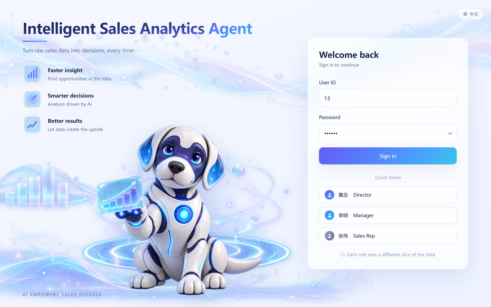
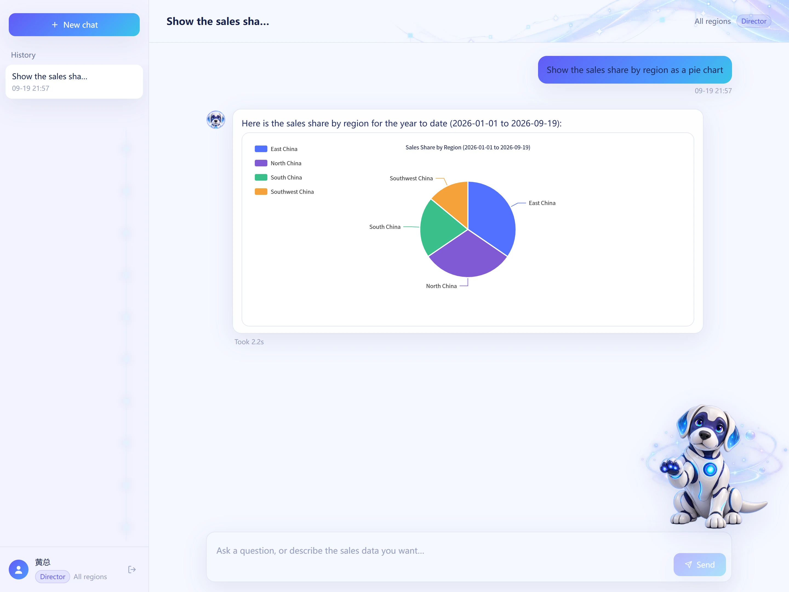
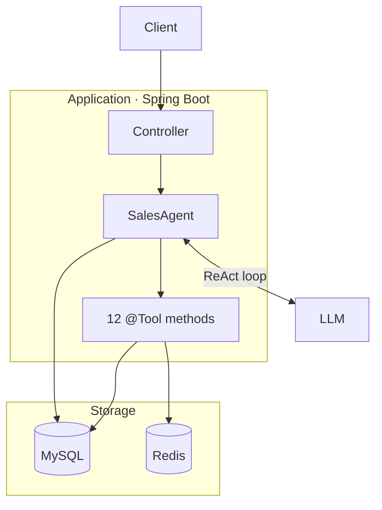

<div align="center">

# 📊 Intelligent Sales Data Analysis Agent

Translates natural language questions into multi-step tool invocation workflows for data retrieval, statistical analysis, trend analysis and chart generation.


English · [简体中文](README.zh-CN.md)

Screenshots · Architecture · Tech Stack · Features · Highlights · Requirements · Getting Started

</div>

## 📸 Screenshots



**Sign-in** — bilingual UI, one-click demo accounts for each role



**Chart generation** — the agent picks the tool, aggregates the data, and the chart renders inline in the reply

## 🏗 Architecture



The Controller layer only resolves the caller's identity and delegates; the reasoning lives in `SalesAgent`, which LangChain4j assembles from a `@SystemMessage` interface plus the tool set. A turn runs as a loop — the model proposes a tool call, the framework invokes the matching method, the result is handed back, and the model decides whether to call another tool or answer.

- **MySQL** — orders, reps, products and regions, plus the conversation memory persisted in `sa_chat_memory`
- **Redis** — Spring Cache backing the rep, region and product rankings plus the monthly-trend queries
- **LLM** — the model that drives tool selection

One question, three tools, no hard-coded branch:

```
  User ──▶ Why did sales drop this month?
             │
             ├─ getSalesSummary      Query this month's total revenue and order count
             ├─ calcMonthOverMonth   Compare with last month to locate the drop
             └─ detectAllAnomalies   Check whether the fluctuation is anomalous
             │
  Reply ◀── Revenue this month was ¥1,234,567, down 18.3% MoM. The drop is
            concentrated in East China (-32%), which has triggered a
            "regional order volume plunge" alert.
```

## 🧰 Tech Stack

| Category | Technology |
| --- | --- |
| 🧩 Backend | Spring Boot 3.5, Spring Web, Spring WebFlux (SSE) |
| 🤖 AI orchestration | LangChain4j 1.12 (`AiServices`, `@Tool`, `ChatMemory`, `ChatModelListener`) |
| 🗄 Database | MySQL 8, Spring Data JPA / Hibernate |
| ⚡ Cache | Redis (Spring Cache) |
| 🔐 Authentication | Sa-Token 1.39 |
| 📈 Monitoring | Micrometer, Spring Boot Actuator |
| 🛠 Tooling | Maven, Lombok, Jackson |

## ✨ Core Features

| Feature | Description |
| --- | --- |
| 🔐 Authentication | Login issues a token carried in the `Authorization` header |
| 💬 Natural-language query | Ask in plain language; the agent works out what to fetch on its own |
| 🧮 Summaries & rankings | Rep, region and product rankings plus period totals |
| 📈 Trend analysis | Month-over-month, year-over-year and N-month trends |
| 📊 Charts | Line, bar and pie emitted as ECharts option JSON |
| 🚨 Anomaly detection | Region order drops, zero-sale products, refund-rate spikes, rep performance drops |
| 🧠 Conversation memory | Multi-turn context persisted in MySQL, survives a restart |
| ⚡ Streaming | Server-Sent Events push tokens as they are produced |
| 🔒 Role-based access | Director / manager / rep scopes enforced inside the tool methods |
| ⏱ Caching | Rankings and trends cached in Redis through Spring Cache, 5-minute TTL |
| 🔍 Observability | Micrometer metrics for tokens, tool latency and exceptions, exposed via Actuator |

## 🔧 Technical Highlights

**Tool authorization** — Visibility for the three roles is decided inside each `@Tool` method, with the controller checking only the login state; a tool resolves the region name, narrows scope with `getEnforcedRegionId()`, then decides with `checkRegionAccess()` — a manager omitting the argument stays in their own region, another region is refused, and a rep gets a refusal message.

**Tool orchestration** — 12 `@Tool` methods across five classes, with the model choosing both the tool and the order and no reporting branch hard-coded; each description declares its scope, and `queryOrders` names what it should not be used for, which keeps it out of ranking and charting work.

**Chart pipeline** — Chart data never passes through the model. The chart tools hand the ECharts option to a `ChartPayloadCollector` and return only a one-line notice; the model emits a `[[CHART]]` placeholder, and the controller pushes the raw JSON over a dedicated `chart` event from `onToolExecuted`, which the client substitutes back in order. Asking the model to reproduce a 400-character JSON verbatim is unreliable — it was observed flattening the `series` array into an object, leaving the client with nothing but a blank canvas — while a placeholder costs eight characters instead of several hundred output tokens. The client keeps the older `CHART_JSON:` path so existing conversations still render.

## 🌐 Environment Requirements

- JDK 21 or later
- MySQL 8.0 or later
- Redis 6.0 or later
- Maven 3.8 or later

## 🚀 Getting Started

### 1. Create the database

The SQL scripts contain no `CREATE DATABASE` statement, so create an empty database first:

```bash
mysql -h 127.0.0.1 -u root -p -e "CREATE DATABASE IF NOT EXISTS \`aynm-sales-agent\` DEFAULT CHARSET utf8mb4;"
```

Tables and demo data are imported automatically on startup — `spring.sql.init` runs `db/schema.sql` then `db/data.sql`, in that order.

Both scripts are idempotent. Every table is created with `CREATE TABLE IF NOT EXISTS`, and `data.sql` clears the four business tables before re-inserting, so each startup reloads a clean demo dataset. `sa_chat_memory` is deliberately left alone, so conversation history survives a restart.

> **The demo data is generated relative to `CURDATE()`.** Whenever you run it, there are always seven months of history behind it, so trend and year-over-year queries have something to work with.

### 2. Configure the connections

`application.yml` holds no secrets — the three sensitive values are read from the environment:

| Variable | Used by | Required |
| --- | --- | --- |
| `API_KEY` | Chat model API key | Yes — the placeholder has no default |
| `MYSQL_PWD` | `spring.datasource.password` | Yes |
| `REDIS_PWD` | `spring.data.redis.password` | No — leave empty if Redis has no password |

Everything else is edited directly in the file:

| Setting | Purpose |
| --- | --- |
| `spring.datasource.url` / `username` | MySQL connection |
| `spring.data.redis.host` / `port` | Redis connection |
| `langchain4j.open-ai.chat-model.*` | Model name, base URL, temperature, max tokens |
| `langchain4j.open-ai.streaming-chat-model.*` | The same, for the SSE path |
| `server.port` | Defaults to `8087` |

```bash
export API_KEY=sk-xxxxxxxx
export MYSQL_PWD=your_password
export REDIS_PWD=
```

### 3. Start the dependencies

- **MySQL 8.0+** — required. The init scripts run against it during startup.
- **Redis 6.0+** — backs the cache layer. The application does boot without it, but any query routed through the cache will fail at runtime.

### 4. Run the application

Requires JDK 21 — the build targets Java 21.

```bash
# Development mode
mvn spring-boot:run

# Or package and run
mvn clean package -DskipTests
java -jar target/aynm-sales-agent-1.0.0.jar
```

The service listens on port `8087`.

### 5. Verify

`/actuator/**` is on the no-login whitelist, so the health check needs no token:

```bash
curl http://localhost:8087/actuator/health
# {"status":"UP"}
```

Then log in and ask something. `db/data.sql` seeds 13 accounts, all with password `123456`:

| repId | Role | Scope |
| --- | --- | --- |
| 13 | `SALES_DIRECTOR` | Every region |
| 1 | `SALES_MANAGER` | East China |
| 2 | `SALES_REP` | Own records only |

> The application, its seed data and the agent's replies are all in Chinese. Region labels here are translated for readability; the repId is what you actually log in with.

```bash
curl -X POST http://localhost:8087/auth/login \
  -H "Content-Type: application/json" \
  -d '{"repId":13,"password":"123456"}'
# {"token":"<uuid>","username":"<name>","role":"SALES_DIRECTOR"}
```

Pass that token back in the `Authorization` header:

```bash
curl -X POST http://localhost:8087/agent/chat \
  -H "Content-Type: application/json" \
  -H "Authorization: <token>" \
  -d '{"sessionId":"demo-1","message":"Are there any anomalies?"}'
```

> The seed data carries four deliberate anomalies — one region has had no orders for 14 days, one SKU none for 30, one rep's volume collapses partway through the window, and another rep's refund rate sits well above the threshold — so this question should return concrete findings; a plain "nothing detected" reply would signal a problem.

## 📌 Optional setup

- **Exercising tools directly** — `/test/tool/**` exposes each tool method over HTTP so you can test one in isolation without going through the model. These endpoints still require a token.
- **Auth bypass** — `app.auth.enabled=false` skips the login interceptor for local development. It only removes the interceptor: the controllers still read the Sa-Token session, so `/agent/**` stays unusable without a real login.

## 📁 Project Structure

```
src/main/java/com/ayanami/salesAgent/
├── agent/        # SalesAgent interface + AiServices wiring (model, tools, memory, hooks)
├── tool/         # 12 @Tool implementations
├── security/     # UserContext authorization checks + tool input validation
├── service/      # Sales data query service
├── memory/       # MysqlChatMemoryStore conversation persistence
├── config/       # Interceptors, Redis, Micrometer metrics
└── controller/   # Auth, sync / streaming chat, global exception handling
```
