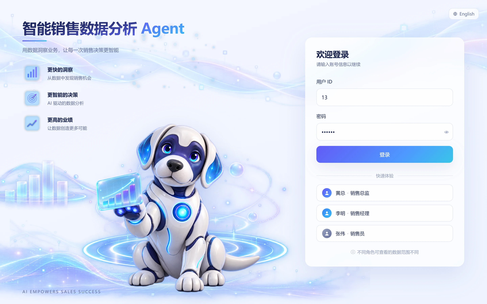
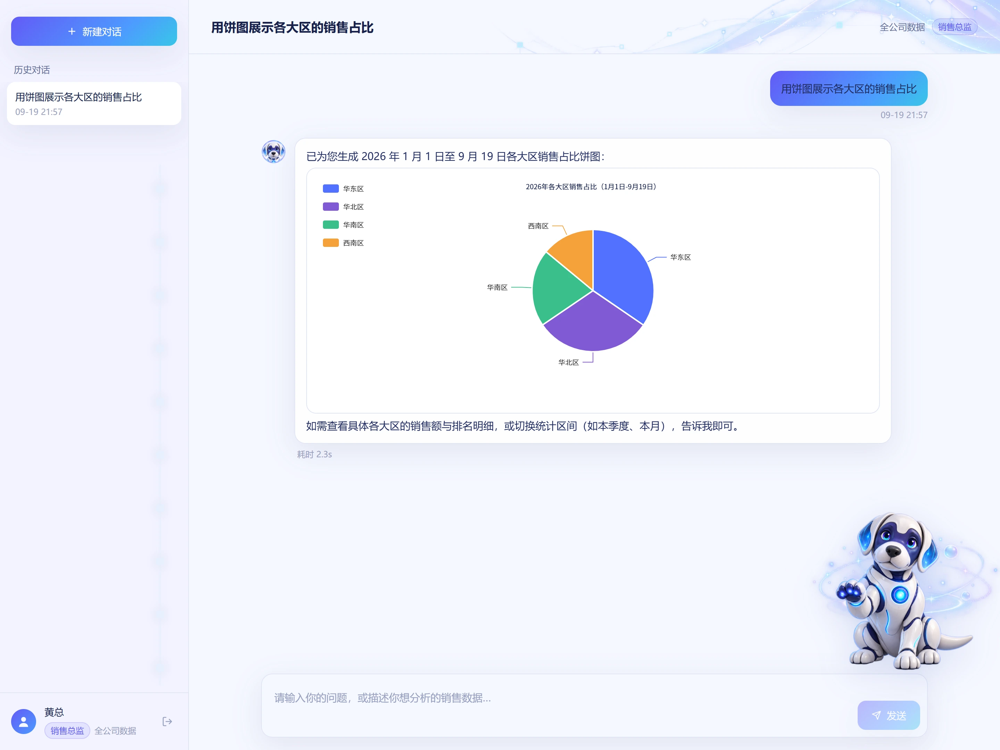
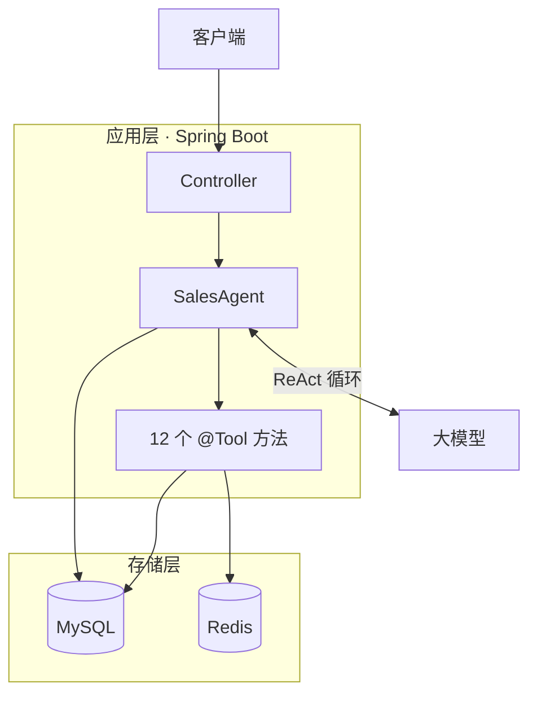

<div align="center">

# 📊 智能销售数据分析 Agent

把自然语言问题转成多步工具调用，自动完成取数、统计、趋势分析与图表生成。


[English](README.md) · 简体中文

界面截图 · 架构 · 技术栈 · 核心功能 · 技术亮点 · 环境要求 · 快速开始

</div>

## 📸 界面截图



**登录页** —— 中英双语，三种角色一键填充演示账号



**图表生成** —— Agent 自主选择工具、完成聚合，图表内联渲染在回答里

## 🏗 架构



Controller 层只负责解析调用者身份并转发，真正的推理在 `SalesAgent` 里 —— 它由 LangChain4j 从 `@SystemMessage` 接口和工具集装配而成。一次问答是一个循环：模型提出工具调用，框架执行对应方法，结果回灌给模型，模型再决定继续调用下一个工具还是直接作答。

- **MySQL** —— 订单、销售员、产品、大区，以及持久化在 `sa_chat_memory` 里的对话记忆
- **Redis** —— Spring Cache，承载销售员 / 大区 / 产品排名与月度趋势这几类查询
- **大模型** —— 决定调用哪些工具

一个问题、三个工具、没有任何硬编码分支：

```
  用户 ──▶ 为什么本月业绩下滑？
             │
             ├─ getSalesSummary      查询本月总销售额与订单数
             ├─ calcMonthOverMonth   与上月做环比，定位降幅
             └─ detectAllAnomalies   检测是否存在异常波动
             │
  回答 ◀── 本月销售额 ¥1,234,567，环比下降 18.3%。降幅主要来自华东区
            （-32%），已触发「大区订单量骤降」预警。
```

## 🧰 技术栈

| 分类 | 技术 |
| --- | --- |
| 🧩 后端 | Spring Boot 3.5、Spring Web、Spring WebFlux（SSE） |
| 🤖 AI 编排 | LangChain4j 1.12（`AiServices`、`@Tool`、`ChatMemory`、`ChatModelListener`） |
| 🗄 数据库 | MySQL 8、Spring Data JPA / Hibernate |
| ⚡ 缓存 | Redis（Spring Cache） |
| 🔐 认证鉴权 | Sa-Token 1.39 |
| 📈 监控 | Micrometer、Spring Boot Actuator |
| 🛠 工具 | Maven、Lombok、Jackson |

## ✨ 核心功能

| 功能 | 说明 |
| --- | --- |
| 🔐 登录认证 | 登录签发 token，后续请求通过 `Authorization` 头携带 |
| 💬 自然语言取数 | 直接提问，Agent 自己判断该查什么 |
| 🧮 汇总与排名 | 销售员、大区、产品排名及区间汇总 |
| 📈 趋势分析 | 环比、同比、近 N 个月趋势 |
| 📊 图表 | 折线图、柱状图、饼图，输出为 ECharts option JSON |
| 🚨 异常检测 | 大区订单骤降、产品零销售、退单率异常、员工业绩骤降 |
| 🧠 对话记忆 | 多轮上下文持久化到 MySQL，服务重启不丢 |
| ⚡ 流式输出 | SSE 逐 token 推送 |
| 🔒 权限控制 | 总监 / 经理 / 销售员三级可见范围，在工具方法内校验 |
| ⏱ 结果缓存 | 排名与趋势数据经 Spring Cache 缓存到 Redis，TTL 5 分钟 |
| 🔍 可观测性 | Micrometer 采集 token 消耗、工具耗时与异常计数，通过 Actuator 暴露 |

## 🔧 技术亮点

**工具鉴权链路** —— `@Tool` 方法体内判定三级角色的可见范围，Controller 层只校验登录态；工具先解析大区名并用 `getEnforcedRegionId()` 收窄作用域，再交 `checkRegionAccess()` 判定，经理不传参数时限定在本区、指定其他大区直接拒绝，销售员访问大区级工具返回提示文案。

**工具编排链路** —— 12 个 `@Tool` 分布在 5 个类，选哪个、按什么顺序由模型决定，服务端不写死报表分支；每个描述声明覆盖范围，`queryOrders` 另标注不适用场景，避免被拿去算排名或画图。

**图表链路** —— 图表工具把 ECharts option 交给 `ChartPayloadCollector` 暂存、只回给模型一句提示，模型输出 `[[CHART]]` 占位符，Controller 在 `onToolExecuted` 中以独立的 `chart` 事件下发原始 option，前端按序替换；图表数据全程不经过模型，既避免转述失真，也省掉复述整段 JSON 的数百个输出 token。

## 🌐 环境要求

- JDK 21 或更高
- MySQL 8.0 或更高
- Redis 6.0 或更高
- Maven 3.8 或更高

## 🚀 快速开始

### 1. 初始化数据库

SQL 脚本内不含建库语句，需要先建一个空库：

```bash
mysql -h 127.0.0.1 -u root -p -e "CREATE DATABASE IF NOT EXISTS \`aynm-sales-agent\` DEFAULT CHARSET utf8mb4;"
```

表结构与演示数据会在启动时自动导入 —— `spring.sql.init` 依次执行 `db/schema.sql` 和 `db/data.sql`。

两个脚本都是幂等的。建表语句全部使用 `CREATE TABLE IF NOT EXISTS`，`data.sql` 则先清空四张业务表再重新插入，所以每次启动都会载入一份干净的演示数据。`sa_chat_memory` 被刻意排除在清空范围之外，对话历史不会因重启丢失。

> **演示数据的日期基于 `CURDATE()` 动态偏移**，没有写死。无论何时运行，都能保证有完整的 7 个月历史数据，趋势查询与同比查询始终有数据可算。

### 2. 修改连接配置

`application.yml` 中不含任何密钥，三个敏感值从环境变量读取：

| 环境变量 | 用途 | 是否必填 |
| --- | --- | --- |
| `API_KEY` | 对话模型的 API Key | 必填 —— 占位符没有设默认值 |
| `MYSQL_PWD` | `spring.datasource.password` | 必填 |
| `REDIS_PWD` | `spring.data.redis.password` | 可选 —— Redis 无密码则留空 |

其余配置项直接在文件里改：

| 配置项 | 用途 |
| --- | --- |
| `spring.datasource.url` / `username` | MySQL 连接 |
| `spring.data.redis.host` / `port` | Redis 连接 |
| `langchain4j.open-ai.chat-model.*` | 模型名称、base URL、温度、max tokens |
| `langchain4j.open-ai.streaming-chat-model.*` | 同上，作用于 SSE 流式链路 |
| `server.port` | 默认 `8087` |

```bash
export API_KEY=sk-xxxxxxxx
export MYSQL_PWD=your_password
export REDIS_PWD=
```

### 3. 启动依赖服务

- **MySQL 8.0+** —— 必需，启动时的建表与数据导入都依赖它。
- **Redis 6.0+** —— 缓存层使用。没启动也能把应用拉起来，但走缓存的查询会在运行时报错。

### 4. 启动应用

需要 JDK 21 —— 项目编译目标为 Java 21。

```bash
# 开发模式直接启动
mvn spring-boot:run

# 或打包运行
mvn clean package -DskipTests
java -jar target/aynm-sales-agent-1.0.0.jar
```

服务默认监听 `8087` 端口。

### 5. 验证启动

`/actuator/**` 在免登录白名单内，健康检查不需要带 token：

```bash
curl http://localhost:8087/actuator/health
# {"status":"UP"}
```

接着登录并问一句。`db/data.sql` 内置 13 个账号，密码统一 `123456`：

| repId | 姓名 | 角色 | 可见范围 |
| --- | --- | --- | --- |
| 13 | 黄总 | `SALES_DIRECTOR` | 所有大区 |
| 1 | 李明 | `SALES_MANAGER` | 华东区 |
| 2 | 张伟 | `SALES_REP` | 仅本人数据 |

```bash
curl -X POST http://localhost:8087/auth/login \
  -H "Content-Type: application/json" \
  -d '{"repId":13,"password":"123456"}'
# {"token":"<uuid>","username":"黄总","role":"SALES_DIRECTOR"}
```

把返回的 token 放进 `Authorization` 头：

```bash
curl -X POST http://localhost:8087/agent/chat \
  -H "Content-Type: application/json" \
  -H "Authorization: <token>" \
  -d '{"sessionId":"demo-1","message":"有没有异常？"}'
```

> 演示数据里预埋了四个异常点 —— 华北区近 14 天无订单、SKU-8821 近 30 天零销售、张磊业绩中途断崖、王芳退单率明显偏高，所以这个问题应当返回具体的异常项；若回答「未检测到异常」，说明数据或检测逻辑有问题。

## 📌 可选配置

- **单独调试工具** —— `/test/tool/**` 把每个工具方法单独暴露成 HTTP 接口，可以绕开模型直接测某一个工具。这些接口同样需要登录。
- **关闭鉴权** —— 本地开发可设 `app.auth.enabled=false` 跳过登录拦截器。它只是移除拦截器：Controller 仍会读取 Sa-Token 会话，所以 `/agent/**` 在没有真实登录的情况下依然不可用。

## 📁 项目结构

```
src/main/java/com/ayanami/salesAgent/
├── agent/        # SalesAgent 接口定义 + AiServices 装配（模型、工具、记忆、钩子）
├── tool/         # 12 个 @Tool 工具
├── security/     # UserContext 权限判定 + 工具入参校验
├── service/      # 销售数据查询服务
├── memory/       # MysqlChatMemoryStore 对话记忆持久化
├── config/       # 拦截器、Redis、Micrometer 指标
└── controller/   # 登录、同步 / 流式对话、全局异常处理
```
